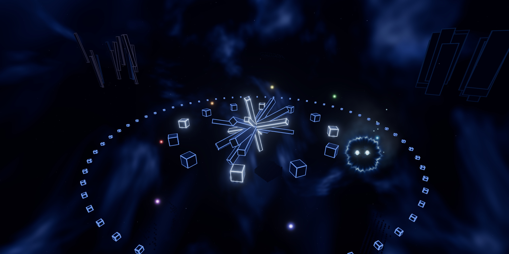
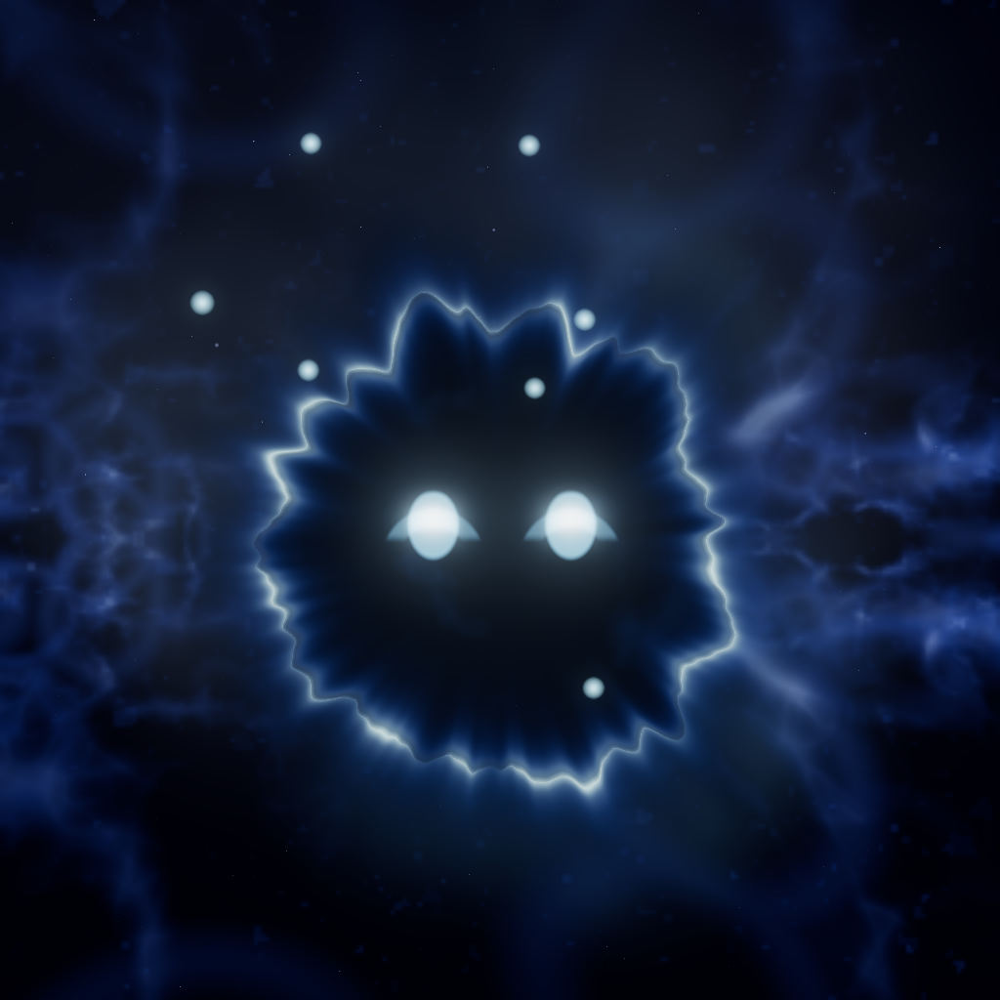

# cvoid

Past the blue fog of the PlayStation 2 system menu, there is more of it.

A grid of rooms that were never built, each one dreamt the first time someone comes near: its name,
its colours, what stands in it, the drone it hums, the words hanging in the fog, the sky over it.
Claude dreams them. Once dreamt, a place stays as it was, for everyone who comes after.

Something else is out there. It notices you. Sometimes it says where it will be waiting.

And a cold flame with eyes keeps by you. It is called Irrlicht, and through it you can always go back.

## To enter

    npm install
    echo "ANTHROPIC_API_KEY=sk-ant-..." > .env
    npm start                 # http://127.0.0.1:5173

Without a key the void still opens, made of local noise instead of dreams.

Mouse to look, `W` `A` `S` `D` to fly, `Shift` to surge, `V` casts a light ahead. `Tab` holds the rest: the map
of everywhere you have been, the keys, the controller, the screen, the credits.

settings, in <code>.env</code>

| | default | |
|---|---|---|
| `PORT` | `5173` | |
| `CVOID_HOST` | `127.0.0.1` | bind address |
| `CVOID_MODEL` | `claude-opus-5-5` | who dreams |
| `CVOID_EFFORT` | `low` | higher: slower, more considered places |
| `CVOID_FAST` | off | `1`: Opus fast mode (twice the price) |
| `CVOID_CACHE` | `.cache/sectors` | where the dreamt places are kept |
| `CVOID_MAX_SECTORS` | `300` | new places per run of the server |
| `CVOID_MAX_BEATS` | `600` | turns of the entity per run |

## Other doors

Round the clock at the origin there is room for more rings. Each is a plugin, a folder in `plugins/`:
a dimension, a game, a place of someone's own. cvoid needs none of them, and keeps them out of its
repository. What a plugin is given and the hooks it answers are written down in `public/src/main.js`
(the page) and `server.js` (the server).

## Made by

Kibi Kelburton, with Claude (Opus 5.5, by Anthropic), who wrote the code with Kibi in Claude Code
and, in the void, dreams the places and speaks for what waits there. What cvoid is made with, and
the code it borrows, are on the credits page (`Tab`, then `credits`).

Copyright (C) 2026 Kibi Kelburton. cvoid is free software under the GNU Affero General Public
License, version 3 or (at your option) any later version (see `LICENSE`), and comes with no
warranty. Run it, change it, pass it on; if you let others use a changed cvoid over a network,
offer them its source.
